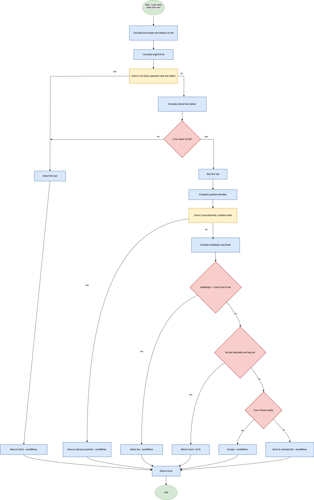
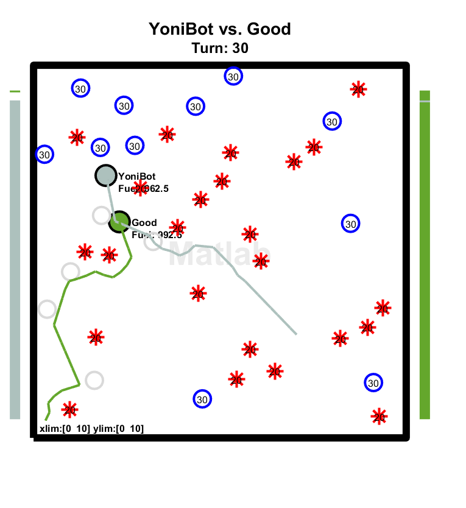

# 🤖 MATLAB Robot Competition

A smart robot competition project in MATLAB – featuring real-time strategy, path planning, fuel management, and opponent prediction.

---

## 🧬 Algorithm Flowchart

The following diagram illustrates the logic behind the robot's strategic decisions:

---

## 🖼️ Game Preview

Example in-game situation showing the robot in action:

---

## 📁 Project Structure

The code is organized into several main components:
- `robostrategy_yoni.m` – the main strategy function used by the robot
- Helper functions that handle:
  - Fuel station selection
  - Mine and trap avoidance
  - Opponent behavior analysis
  - Basic pathfinding and fallback logic

---

## 🚀 How to Run

1. Open MATLAB
2. Make sure all files are in the same folder
3. Set `robostrategy_yoni` as the robot’s strategy function in the competition environment
4. Run the game – the robot will act automatically using its strategy

---

## 🧠 Key Features

- Real-time map analysis
- Smart fuel station ranking system
- Trap and mine avoidance
- Opponent prediction and counter-behavior
- A* pathfinding as fallback when safe options are limited

---

## 🛠️ Requirements

- MATLAB 2020a or later
- Competition engine and game files provided by the organizers

---

## 📄 License

Free to use for educational and academic purposes only.
